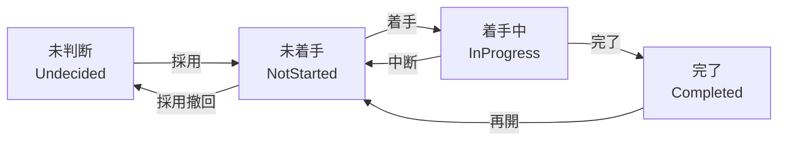

# axon

[English](README.md)

Issue と Group で個人の仕事や計画を管理するローカル CLI です。アイデアを未判断のまま記録し、Group の階層や依存関係で仕事を整理して、Note と変更履歴を残せます。

データはローカルの `.axon/` に保存します。個人用に保持することも、プロジェクトと一緒に Git で管理することもできます。

## Issue のライフサイクル

思いついた仕事は、実施するか決める前に記録できます。採用した Issue は、未着手から着手中、完了へ進みます。



未判断・未着手・着手中の Issue は取りやめ（`Cancelled`）にでき、再検討すると未判断に戻ります。全ての状態と遷移は [ライフサイクルの詳細](docs/reference/lifecycle.md#遷移) を参照してください。

## 必要になったら再浮上

「この日になったら」「ファイルができたら」「外部サービスの状態が変わったら」。シェルコマンドで判定できることなら、何でも再浮上条件にできます。既存の CLI や自作スクリプトを使い、複数の条件を組み合わせることもできます。

条件は候補一覧を取得するときなどに評価され、成立した仕事が再び候補に現れます。たとえば、`ready.txt` が存在することを条件にするには、`ID` を対象の Issue の ID に置き換えて実行します。

```sh
axon condition set ID --command 'test -f ready.txt'
```

コマンドの終了コードが `0` なら成立、`1` なら未成立、それ以外は判定エラーです。「後で考える」Issue は、未判断のまま条件を付けて残せます。詳しくは [再浮上条件](docs/reference/candidates.md#条件の種類) を参照してください。

## インストール

macOS 15（Sequoia）以上の Apple Silicon / Intel と [Homebrew](https://brew.sh) が必要です。

```sh
brew install gin0606/tap/axon
```

更新するときは次を実行します。

```sh
brew update
brew upgrade gin0606/tap/axon
```

Rust の導入は不要です。開発やソースからのビルド（Rust 1.89 以上）は [導入ガイド](docs/guide/getting-started.md#開発者向けのソースビルド) を参照してください。Linux と WSL2 は未検証のベストエフォート、ネイティブ Windows は非対応です。

## 使い始める

仕事を管理したいディレクトリで実行します。

```sh
axon init work
axon capture --label docs --title '利用ガイドを書く' -m 'インストールと基本操作を説明する。'
axon proposals
```

作業の進め方や Git での設定は [導入ガイド](docs/guide/getting-started.md) を参照してください。

## エージェント向けスキル

Claude Code と Codex 向けのプラグインを同梱しています。

- [axon](plugins/axon/skills): 人とエージェントの協業にそのまま使えるワークフロー。
- [axon-kit](plugins/axon-kit/skills): 独自のワークフローを作るための基本操作と契約。

[ワークフローのサンプル](examples/agent-workflow/README.md) に、プラグインの導入手順と、計画・実装・検証・commit を進めるスキルがあります。そのまま利用することも、自分の運用に合わせて変更することもできます。

## ドキュメント

コマンド一覧は `axon --help`、状態と日常の操作は `axon docs` で確認できます。

- [使い始める](docs/guide/getting-started.md)
- [日常の操作](docs/guide/usage.md)
- [開発資料を含む文書一覧](docs/README.md)

## ライセンス

[MIT](LICENSE)
