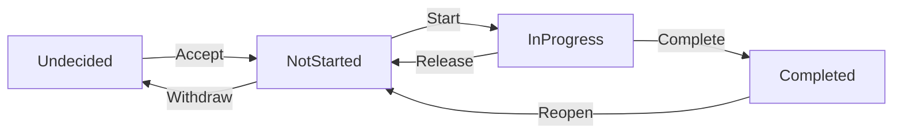

# axon

[日本語](README.ja.md)

A local CLI for managing personal tasks and plans as Issues and Groups. Capture ideas before deciding what to do, organize work with nested Groups and dependencies, and keep notes and a history of changes.

Data lives in a local `.axon/` directory. You can keep it private or track it in Git alongside your project.

## Issue lifecycle

Capture work before deciding whether to do it. Once accepted, an Issue moves from not started to in progress to completed.



You can cancel an undecided, not-started, or in-progress Issue (`Cancelled`), then reconsider it to return it to `Undecided`. See [Lifecycle details](docs/reference/lifecycle.md#遷移) for all states and transitions.

## Resurface when relevant

When a date arrives, a file appears, or an external service changes state: anything a shell command can check can become a resurfacing condition. Use existing CLIs or your own scripts, and combine multiple checks as needed.

Conditions are evaluated when retrieving candidate lists and in other relevant views. Work with a satisfied condition comes back into view. For example, to wait for `ready.txt` to exist, replace `ID` with the target Issue's ID:

```sh
axon condition set ID --command 'test -f ready.txt'
```

Exit code `0` means satisfied, `1` means not satisfied, and any other code is an evaluation error. Keep an Issue undecided with a condition attached when you want to think about it later. See [Resurfacing conditions](docs/reference/candidates.md#条件の種類) for details.

## Install

On macOS 15 (Sequoia) or later, with Apple Silicon or Intel and [Homebrew](https://brew.sh):

```sh
brew install gin0606/tap/axon
```

To update:

```sh
brew update
brew upgrade gin0606/tap/axon
```

Rust is not required. For development or building from source (Rust 1.89 or later), see [Getting started](docs/guide/getting-started.md#開発者向けのソースビルド). Linux and WSL2 remain unverified, best-effort environments; native Windows is not supported.

## Quick start

In the directory where you want to manage work:

```sh
axon init work
axon capture --label docs --title 'Write a user guide' -m 'Explain installation and basic usage.'
axon proposals
```

See [Getting started](docs/guide/getting-started.md) for the full workflow and Git setup.

## Agent skills

Plugins for Claude Code and Codex are included:

- [axon](plugins/axon/skills): ready-to-use workflows for collaboration between you and an agent.
- [axon-kit](plugins/axon-kit/skills): core operations and contracts for building your own workflows.

The [example workflow](examples/agent-workflow/README.md) includes plugin installation instructions and skills for planning, implementation, verification, and commits. You can use it as-is or adapt it to your workflow.

## Documentation

Run `axon --help` for commands and `axon docs` for the lifecycle and daily workflow. Detailed guides are currently in Japanese:

- [Getting started](docs/guide/getting-started.md)
- [Daily usage](docs/guide/usage.md)
- [All documentation, including development](docs/README.md)

## License

[MIT](LICENSE)
